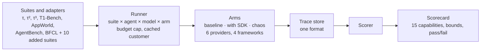

# AgentCompile Bench

One benchmark run that tests everything an agent compiler claims: same answers, fewer agent calls, fewer wrong actions, correct hand-offs, latency, consistency, fail-open safety, and every provider. It unifies existing agent benchmarks under one runner and one scorecard, and adds the suites none of them have.

Status: design. The full spec and build plan are in [docs/SPEC.md](docs/SPEC.md).

