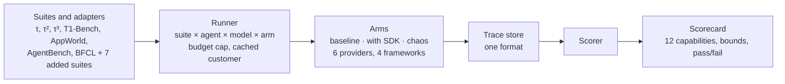

# AgentCompile Bench

One benchmark run that tests everything an agent compiler claims: same answers, fewer agent calls, fewer wrong actions, correct hand-offs, latency, consistency, fail-open safety, and every provider. It unifies existing agent benchmarks under one runner and one scorecard, and adds the suites none of them have.

Status: milestone 1 (runner, trace format, scorecard). The full spec and build plan are in [docs/SPEC.md](docs/SPEC.md); the trace format is in [docs/TRACE.md](docs/TRACE.md).

## Quickstart

```
pip install -e ".[dev,tau]"     # on Windows: set PYTHONUTF8=1 first (τ-bench's setup.py)
pytest                          # offline, $0: toy suite through the real SDK and a local decision service
```

A τ-bench retail run, both arms, on the 40 dev tasks:

```
export GEMINI_API_KEY=...  AGENTCOMPILE_KEY=ack_...
acbench run --suite tau-retail --split dev --arms baseline,sdk \
  --agent gemini/gemini-2.5-flash --customer gemini/gemini-2.5-pro --budget 5
acbench score runs/<run id>     # rewrites runs/<run id>/scorecard.md and scorecard.json
acbench gate runs/<run id>      # exit 1 if any capability failed its criterion
```

Each run writes `manifest.json`, `trace.jsonl`, `scorecard.md` and `scorecard.json` under `runs/<run id>/`. The `--budget` cap is hard: no model call starts once it is reached, and the scorecard says the run is incomplete.

| Piece | Where |
| --- | --- |
| Task format | `src/acbench/tasks.py` |
| Suites: τ-bench retail, offline toy shop | `src/acbench/suites/` |
| Reference agent (raw tool-calling loop) | `src/acbench/agent.py` |
| Arms: `baseline`, `sdk`, `shadow` (real `agentcompile.wrap`) | `src/acbench/arms.py` |
| Runner: worker pool, budget cap, arms side by side | `src/acbench/runner.py` |
| Trace format | `src/acbench/trace.py`, [docs/TRACE.md](docs/TRACE.md) |
| Scorer and paired bootstrap | `src/acbench/scorer.py`, `src/acbench/stats.py` |
| Scorecard and CI gate | `src/acbench/scorecard.py`, `acbench gate` |


