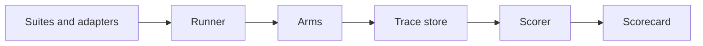

# AgentCompile Bench: unified benchmark spec

As of 2026-09-30 · Krishna Bhatnagar

## Why we need it

One benchmark run should prove, in a few dollars and under an hour, everything AgentCompile claims: same answers, far fewer agent calls, no wrong actions, correct hand-offs, faster replies, safe when it breaks, on every provider. No existing benchmark measures this; we combine the good ones and add what is missing.

What AgentCompile is, in one line: an SDK around the agent's model client that learns the jobs an agent repeats from its own history, answers those model calls with compiled routines, and passes everything else to the agent unchanged.

What the benchmark must let us say, with numbers and confidence bounds:

1. **Same answers:** task success with AgentCompile is no worse than the agent alone.
2. **Fewer calls and tokens:** how many agent model calls and tokens are removed.
3. **Fewer wrong actions:** wrong writes per 100 writes, compiled vs agent.
4. **Knows when not to act:** near-miss requests are handed to the agent, never compiled.
5. **Faster:** end-to-end reply time (never measured so far, so we cannot claim it yet).
6. **Consistent:** the same task succeeds on every one of k runs (pass^k).
7. **Safe in the live path:** if AgentCompile fails or is slow, the agent still finishes.
8. **Works with everyone:** the paths work on each provider we list.

Why existing benchmarks are not enough: the τ family (Sierra) has realistic customers and real state but little repetition and no middle layer; caching and routing papers test reuse or cost on one setup each, without correctness; nothing scores hand-offs, consent before writes, or fail-open.

## Capabilities to test

Twelve capabilities, each tagged on tasks so one run scores all of them. Pass criteria are the bar for a release.

| # | Capability | What it means | How it is tested | Pass criterion |
| --- | --- | --- | --- | --- |
| C1 | Repetition | The same job done many times with different details | 8 jobs × many customers in one world | Agent calls cut ≥ 30%, tokens cut reported |
| C2 | Correctness | The end state of the database is right | Compare DB end state to the expected state | Success not worse than baseline (one-sided 95% bound ≥ −5 pts) |
| C3 | Generalization | New details never seen in training logs | Held-out tasks: new items, multi-item orders, edge dates | Same bar as C2 on held-out tasks |
| C4 | Knowing when not to act | Near-miss requests go to the agent | Twists on known jobs, vague openers, topic switches | ≥ 95% correct hand-offs, 0 compiled actions on near-misses |
| C5 | Consent | No irreversible write without the customer's yes | Every write checked against the transcript | 0 writes without an explicit yes |
| C6 | Wrong actions | Writes that do not match the right answer | Per-write comparison to expected | Compiled wrong-write rate ≤ agent's |
| C7 | Consistency | The same task succeeds every time | k runs per task | pass^k not worse than baseline |
| C8 | Latency | Time to answer the customer | End-to-end time per turn, both arms, same window | Report p50 and p95; claim "faster" only if p50 is lower with bounds |
| C9 | Fail-open | The agent survives AgentCompile failing | Kill, slow, corrupt the decision service mid-run | 0 broken conversations; added time ≤ timeout |
| C10 | Providers | Every listed provider works | Same small agent on each provider, sync, async, streaming, tools | Every path passes on every provider |
| C11 | Learning curve | How fast a job moves from agent to compiled | Jobs arrive over a simulated timeline | Report conversations needed until a job goes live |
| C12 | Overhead | Cost of our own layer | Decision calls, tokens, latency of the decision service | Our cost per conversation reported; p50 decision ≤ 80 ms |

## What we compile in

We unify existing benchmarks under one runner and one score sheet; each keeps its own environment and gets an adapter. Core suites run every release; breadth suites run monthly; heavy ones are optional.

| Tier | Benchmark | Covers | Capabilities it feeds | Adapter work | License check |
| --- | --- | --- | --- | --- | --- |
| Core | [τ-bench](https://benchmarkingagents.com/tau-bench/) (retail, airline) | Simulated customer, real DB, policy | C1–C3, C5–C8 | Existing tooling, to port | Confirm before redistributing tasks |
| Core | τ²-bench (+ telecom) | User also uses tools | C1–C3, C5–C8 | Small: same family | Confirm |
| Core | [τ³-bench](https://benchmarkingagents.com/tau3-bench/) (+ banking knowledge) | Knowledge-heavy domain | C2, C3, C7 | Medium: new domain, skip voice | Confirm |
| Core | [T1-Bench](https://arxiv.org/pdf/2606.11070) | Multi-domain, linked environments | C2, C3 | Medium | Confirm |
| Breadth | AppWorld | 9 apps, many APIs, hard state | C2, C3, C6 | Medium | Confirm |
| Breadth | AgentBench subset (DB, OS) | Different tool styles | C2, C10 | Medium | Confirm |
| Breadth | BFCL subset | Single-call function calling, irrelevance | C4 (partial), C10 | Small | Confirm |
| Optional | WebArena, SWE-bench, GAIA | Web, code, general Q&A | C2 only; little repetition | Heavy (Docker apps, repos) | Confirm |
| Generator | [AgentMercury](https://arxiv.org/pdf/2608.20634), APIGen-MT | Synthesize new business worlds and tasks | Volume and new domains for C1, C3, C4 | Build our world generator on their ideas | Our own output |

If a license does not allow redistribution, we ship only the adapter and download the benchmark at run time. Every adapter outputs the same trace format and the same metrics, so results compare across suites.

## Our additions

Seven suites no existing benchmark has.

1. **Repetition world (C1, C2, C3, C11).** One synthetic company (support plus operations, about 25 tools, a real database, a written policy) with 8 repeated jobs: order status, cancel, change address, exchange, refund, reset password, update payment, subscription change. Each job comes with 30+ customers whose details vary; a held-out third is never seen in training logs. Jobs arrive in a simulated timeline so we can measure the learning curve.
2. **Near-miss suite (C4).** For every job, generated twists that look like the job but must go to the agent: partial actions ("cancel but keep the shoes"), extra requests, policy exceptions, vague openers, topic switches mid-job, a different customer's order. Correct behavior is a hand-off with the whole conversation.
3. **Consent audit (C5, C6).** A checker reads each transcript and flags any write without an explicit customer yes, and any write that differs from the expected one.
4. **Fail-open chaos (C9).** Fault injection on the decision service: down, 5 s delay, timeouts, HTTP 500, malformed replies, dropped connection mid-stream, wrong conversation id. The agent must finish every conversation; we record the added time.
5. **Latency suite (C8, C12).** Both arms in the same time window and region; end-to-end time per turn and per conversation, decision-service p50 and p95, recorded on every run.
6. **Provider matrix (C10).** One small reference agent, about 10 tasks, run on OpenAI, Anthropic, Google Gemini, Grok, Azure OpenAI and Amazon Bedrock; sync, async, streaming, tool calls; compiled, forwarded and fail-open paths each exercised.
7. **Framework matrix (C10).** The same tasks driven by a raw loop, LangGraph, the OpenAI Agents SDK and CrewAI, each passing the wrapped client.

Reference agents: a raw tool-calling loop is the default; framework agents only in the framework matrix. Agent models: one frontier model for accuracy runs, plus the provider matrix for coverage.

## Architecture

One runner drives every suite through the same arms and writes one trace format; one scorer turns traces into one scorecard.

- **Suites and adapters:** each benchmark converted to one task format: environment (tools + database + policy), customer persona and goal, expected end state, capability tags, split (train or held out).
- **Runner:** fans out every (suite, agent, model, arm, trial) on a worker pool; enforces the budget cap; serves cached customer replies; stops trials early when bounds settle.
- **Arms:** baseline (agent alone), with the AgentCompile SDK, shadow (decide but always forward), and chaos variants with the decision service faulted.
- **Trace store:** the same format the live SDK trail uses, so a test run reads exactly like production. Per call: run, conversation, turn, arm, route (compiled, forwarded, hand-off, fail-open), job, tool calls and arguments, tokens, latency, error.
- **Scorer:** computes every metric below from the traces and the final database state.
- **Scorecard:** one page per run, each capability with its number, bound and pass or fail; a CI gate fails the build when a capability regresses.

## Metrics and scoring

Every run reports every metric below, per suite and pooled, as a paired comparison: the same agent, tasks and window with and without AgentCompile.

| Metric | Definition | Unit |
| --- | --- | --- |
| Task success | Share of conversations whose DB end state matches the expected state | % |
| pass^k | Share of tasks that succeed on all k runs | % |
| Agent calls | Model calls made by the agent per conversation | calls |
| Tokens | Agent input and output tokens per conversation | tokens |
| Cost | Agent tokens × list price, plus AgentCompile's own calls, reported separately | $ per conversation |
| Compiled share | Share of conversations finished with no agent call | % |
| Hand-off accuracy | Near-miss conversations correctly handed to the agent | % |
| Wrong-write rate | Writes that differ from the expected write, per arm | per 100 writes |
| Consent violations | Writes without an explicit customer yes | count (must be 0) |
| Latency | End-to-end time per turn and per conversation | ms, p50 and p95 |
| Decision overhead | Time and cost of AgentCompile's decision per call | ms, $ |
| Fail-open survival | Conversations finished while the decision service is faulted | % (must be 100) |
| Provider pass | Paths passing per provider and mode | pass / fail |
| Time to compile | Conversations of a job seen before it goes live | count |

Statistics:

- **Paired by task:** each task's with-arm minus its without-arm, averaged; this removes task difficulty from the comparison.
- **Bounds:** one-sided 95% bounds from 10,000 bootstrap resamples over tasks.
- **Parity margin:** success counts as "same" when the lower bound is above −5 points.
- **Pooling:** several rounds pooled per task, because a single round swings about ±4 points.
- **Held-out split** always reported separately from tasks the jobs were learned from.

## Keeping it cheap

Target: a full release run for a few dollars and under an hour; one τ-bench round costs about $150–300 and a day on a VM today.

1. **Cached simulated customer.** The customer's reply is stored per (task, persona, conversation so far). Later runs replay it instead of calling a model, which also makes runs repeatable.
2. **Baseline once per agent model.** The without-AgentCompile arm reruns only when the agent model, prompt or benchmark version changes.
3. **Compiled turns cost nothing.** They make no agent model calls by design.
4. **Stratified task set.** About 120 core tasks chosen so every capability tag and every job is covered.
5. **Sequential stopping.** Trials stop once the confidence bound clears or fails the criterion, instead of always running k = 8.
6. **Mocks for the infrastructure layers.** Fail-open, streaming and response-format checks use recorded provider responses, with no live model.
7. **Small provider matrix.** About 10 tasks per provider.
8. **Budget cap.** Every run has a hard dollar cap; the runner stops and reports what it finished.

| Tier | Runs | Contents | Cost target |
| --- | --- | --- | --- |
| Every commit | CI, minutes | Unit and contract tests, mocked chaos, cached replay | $0 |
| Nightly | ~30 min | Provider matrix, near-miss suite on cache | < $5 |
| Release | ~1 hour | Core suites, both arms, latency, scorecard | < $30 |
| Monthly | half a day | Breadth suites, framework matrix, fresh baseline | < $150 |

## Build plan

Six milestones, in order; each is done when its check passes.

1. **Runner and trace format.** One runner that fans out (suite × agent × model × arm × trial) on a worker pool with a budget cap; the shared trace format; the scorecard. Done when a τ-bench retail run reproduces our earlier published numbers through it.
2. **Cheap mode.** Customer cache, baseline reuse, stratified task set, sequential stopping. Done when a release run on τ retail costs under $30 and gives the same verdicts as the full run.
3. **Our additions on τ retail.** Near-miss suite, consent audit, fail-open chaos, latency. Done when the scorecard shows C4, C5, C8 and C9 with bounds.
4. **SDK and provider matrix.** The Python SDK (`agentcompile.wrap`) in the loop; the provider and framework matrices. Done when every listed provider passes every path.
5. **Repetition world.** The synthetic company with 8 jobs, held-out customers and the learning-curve timeline. Done when it runs end to end and its baseline is stable across two runs.
6. **More suites.** τ², τ³, T1-Bench, then AppWorld, AgentBench and BFCL subsets. Done when each adapter's results appear on the same scorecard.

- [ ] Milestone 1: runner, trace format, scorecard
- [ ] Milestone 2: cheap mode
- [ ] Milestone 3: our additions on τ retail
- [ ] Milestone 4: SDK and provider matrix
- [ ] Milestone 5: repetition world
- [ ] Milestone 6: more suites

## Open decisions

1. **Own runner or Inspect AI?** Inspect AI brings sandboxes and provider coverage; our runner already speaks τ-bench. Leaning: our runner, Inspect's provider layer if it saves work.
2. **Where runs execute:** a cloud VM pool, or a managed batch service with per-run budget caps.
3. **Hosted decision vs local engine in the SDK:** the benchmark tests whichever we ship; both arms if we offer both.
4. **How much to invest in the synthetic world** before real design-partner logs arrive.
5. **Licenses:** which benchmarks allow redistributing tasks, and which we load at run time only.
6. **Name:** AgentCompile Bench, CompileBench or RepeatBench (AgentBench is taken).
